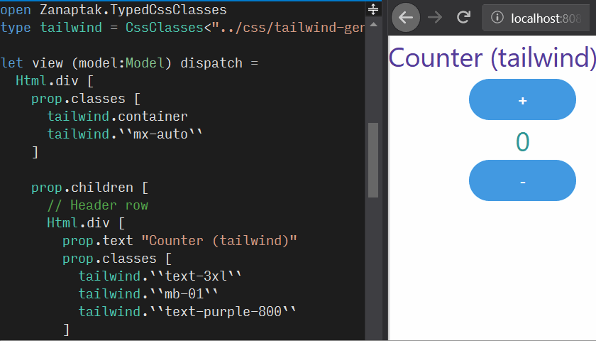

# TypedCssClasses Fable Tailwind Sample

This sample illustrates the following concepts:

* Using [TypedCssClasses](https://github.com/zanaptak/TypedCssClasses) for type-safe CSS class properties in a [Fable](https://fable.io/) single page application.

* Using a locally generated [Tailwind CSS](https://tailwindcss.com/) file with custom options and additional custom CSS classes.

* Using [PurgeCSS](https://www.purgecss.com/) to [reduce the CSS bundle size](https://tailwindcss.com/docs/controlling-file-size). In this sample, it reduces from an initial minified size of ~660KiB to a purged and minified size of ~3KiB due to the small number of CSS classes referenced.

* Using [Feliz](https://github.com/Zaid-Ajaj/Feliz/) for type-safe inline styles when you don't have a CSS class available to produce the desired effect.

## Getting started

Install [.NET Core SDK](https://dotnet.microsoft.com/download).

Install [Node.js](https://nodejs.org/).

Run `npm install`.

Run the `watch.cmd` (Windows) or `watch.sh` (Linux) script, and then browse to `http://localhost:8080`. You should see a simple counter app with blue buttons styled with Tailwind CSS.

## Project structure

* `watch.cmd` (Windows), `watch.sh` (Linux)

  Script to run the application in development watch mode using webpack-dev-server.

* `build.cmd` (Windows), `build.sh` (Linux)

  Script to build the deployable production application using webpack.

* `src/App.fs`

  The application code, including the view code where type-safe CSS classes are used. The application uses [Elmish](https://elmish.github.io/elmish/) architecture.

  In the code, note `type tailwind = CssClasses<...>` to initialize the type provider, `tailwind.`-prefixed CSS class properties, and `style.`-prefixed inline styles.

* `css/tailwind-generated.css`

  The generated file that contains all CSS classes available to your application. This file serves as the comprehensive CSS reference for the TypedCssClasses type provider at design-time.

* `css/tailwind-source.css`

  The source CSS file that is used to generate the tailwind utility classes as well as any custom CSS you have added. In this sample, custom CSS has been added for a common button style.

* `tailwind.config.js`

  The options file for configuring how the tailwind utility classes are generated. In this sample, some of the numeric values have been changed to be zero-padded. This improves sorting in completion lists, since numbers are sorted by leading character, so we get 01, 02, 03, 10, 11, 12 instead of 1, 10, 11, 12, 2, 3.

* `postcss.config.js`

  The file that configures PostCSS with the [@fullhuman/postcss-purgecss](https://github.com/FullHuman/postcss-purgecss) plugin to look at your src/*.fs files to identify used classes, so that it can purge unused classes from the final bundle.

* `deploy/`

  The folder containing the final distributable output of the build script. You can look at the `style.[some hash value].css` file to see the final purged and minified CSS, and you can open `index.html` in the browser to run the application.

## Managing the generated CSS file

Note that the `tailwind-generated.css` file is not the final CSS that ships with deployed versions of your app, it is only the design-time reference. The final CSS gets regenerated and bundled separately each time you perform a build.

If you change any CSS generation options in `tailwind.config.js` or `tailwind-source.css`, you must make sure to update the `tailwind-generated.css` file so that the design-time reference accurately reflects the new configuration. Otherwise, you could end up in a situation where your application successfully compiles against an outdated `tailwind-generated.css` file, but contains incorrect class names that will fail to resolve at runtime against a differently-configured bundle.

To assist with keeping `tailwind-generated.css` up to date, the package.json file defines the command `npm run css` that you can run manually at any time. Additionally, the build and watch scripts provided in this sample always run this as a prebuild step.
